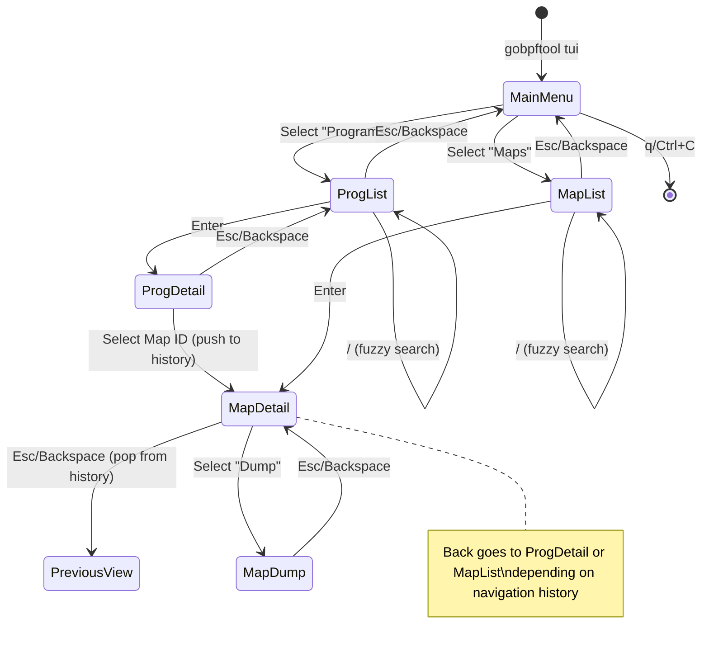

# Design Document: BPF TUI Explorer

## Overview

This document describes the design for `bpftui`, a standalone interactive Terminal User Interface (TUI) application for exploring BPF programs and maps intuitively. The TUI is built using the [Bubbletea](https://github.com/charmbracelet/bubbletea) framework following The Elm Architecture pattern, with [Bubbles](https://github.com/charmbracelet/bubbles) components for common UI elements like lists and text inputs.

The application imports [gobpftool](https://github.com/viveksb007/gobpftool) as a library dependency to leverage its existing BPF service layer for interacting with programs and maps.

The TUI provides a hierarchical navigation experience: Main Menu → List View → Detail View, with fuzzy search available in list views for quick filtering.

## Architecture

The TUI follows Bubbletea's Model-Update-View architecture:

```
┌─────────────────────────────────────────────────────────────┐
│                      TUI Application                         │
├─────────────────────────────────────────────────────────────┤
│  ┌─────────────┐    ┌─────────────┐    ┌─────────────┐     │
│  │    Model    │───▶│   Update    │───▶│    View     │     │
│  │   (State)   │◀───│  (Handler)  │    │  (Render)   │     │
│  └─────────────┘    └─────────────┘    └─────────────┘     │
├─────────────────────────────────────────────────────────────┤
│                     View Components                          │
│  ┌──────────┐ ┌──────────┐ ┌──────────┐ ┌──────────┐       │
│  │   Menu   │ │   List   │ │  Detail  │ │   Dump   │       │
│  │   View   │ │   View   │ │   View   │ │   View   │       │
│  └──────────┘ └──────────┘ └──────────┘ └──────────┘       │
├─────────────────────────────────────────────────────────────┤
│                    Service Layer                             │
│  ┌─────────────────────┐    ┌─────────────────────┐        │
│  │   prog.Service      │    │   maps.Service      │        │
│  │   (existing)        │    │   (existing)        │        │
│  └─────────────────────┘    └─────────────────────┘        │
└─────────────────────────────────────────────────────────────┘
```

### Navigation Flow

The TUI maintains a navigation history stack to support proper back navigation. When navigating from ProgDetail to MapDetail (via associated map IDs), pressing Esc/Backspace returns to ProgDetail, not MapList.



## Components and Interfaces

### Directory Structure

This is a standalone repository (`bpftui`) that imports gobpftool as a library:

```
bpftui/
├── main.go              # Application entry point
├── go.mod               # Module definition with gobpftool dependency
├── go.sum
├── internal/
│   └── tui/
│       ├── tui.go       # Main TUI entry point and root model
│       ├── keys.go      # Key bindings definitions
│       ├── styles.go    # Lipgloss styles for consistent theming
│       ├── menu.go      # Main menu component
│       ├── proglist.go  # Programs list component
│       ├── progdetail.go # Program detail component
│       ├── maplist.go   # Maps list component
│       ├── mapdetail.go # Map detail component
│       └── mapdump.go   # Map dump component
└── README.md
```

### Core Interfaces

#### ViewState Enum

```go
type ViewState int

const (
    ViewMenu ViewState = iota
    ViewProgList
    ViewProgDetail
    ViewMapList
    ViewMapDetail
    ViewMapDump
)
```

#### Root Model

```go
type Model struct {
    // Current view state
    state      ViewState
    
    // Navigation history for back navigation
    // When navigating from ProgDetail -> MapDetail, we push ProgDetail to history
    // On Esc/Backspace, we pop from history to return to the correct view
    history    []ViewState
    
    // Services for data access
    progSvc    prog.Service
    mapsSvc    maps.Service
    
    // Sub-models for each view
    menu       menuModel
    progList   progListModel
    progDetail progDetailModel
    mapList    mapListModel
    mapDetail  mapDetailModel
    mapDump    mapDumpModel
    
    // Terminal dimensions
    width      int
    height     int
    
    // Error state
    err        error
}

// Navigation helpers
func (m *Model) pushState(newState ViewState) {
    m.history = append(m.history, m.state)
    m.state = newState
}

func (m *Model) popState() ViewState {
    if len(m.history) == 0 {
        return ViewMenu
    }
    lastIdx := len(m.history) - 1
    prevState := m.history[lastIdx]
    m.history = m.history[:lastIdx]
    return prevState
}
```

### View Components

#### 1. Menu Component (`menu.go`)

Uses Bubbles `list.Model` for a simple selection menu.

```go
type menuModel struct {
    list list.Model
}

type menuItem struct {
    title       string
    description string
}
```

Menu items:
- "Programs" - Navigate to BPF programs list
- "Maps" - Navigate to BPF maps list

#### 2. Programs List Component (`proglist.go`)

Uses Bubbles `list.Model` with built-in fuzzy filtering.

```go
type progListModel struct {
    list     list.Model
    programs []prog.ProgramInfo
}

type progItem struct {
    info prog.ProgramInfo
}

// Implement list.Item interface
func (i progItem) Title() string       { return fmt.Sprintf("[%d] %s", i.info.ID, i.info.Name) }
func (i progItem) Description() string { return fmt.Sprintf("Type: %s | Tag: %s", i.info.Type, i.info.Tag) }
func (i progItem) FilterValue() string { return i.info.Name }
```

#### 3. Program Detail Component (`progdetail.go`)

Uses Bubbles `viewport.Model` for scrollable content display.

```go
type progDetailModel struct {
    program  *prog.ProgramInfo
    viewport viewport.Model
    mapIDs   []uint32  // For navigation to maps
    cursor   int       // Selected map ID index
}
```

Displays:
- ID, Type, Name, Tag
- GPL status, LoadedAt, UID
- BytesXlated, BytesJIT, MemLock
- Associated Map IDs (selectable)

#### 4. Maps List Component (`maplist.go`)

Uses Bubbles `list.Model` with built-in fuzzy filtering.

```go
type mapListModel struct {
    list list.Model
    maps []maps.MapInfo
}

type mapItem struct {
    info maps.MapInfo
}

// Implement list.Item interface
func (i mapItem) Title() string       { return fmt.Sprintf("[%d] %s", i.info.ID, i.info.Name) }
func (i mapItem) Description() string { 
    return fmt.Sprintf("Type: %s | Key: %d | Value: %d | Max: %d", 
        i.info.Type, i.info.KeySize, i.info.ValueSize, i.info.MaxEntries) 
}
func (i mapItem) FilterValue() string { return i.info.Name }
```

#### 5. Map Detail Component (`mapdetail.go`)

Uses Bubbles `viewport.Model` for scrollable content.

```go
type mapDetailModel struct {
    mapInfo  *maps.MapInfo
    viewport viewport.Model
    cursor   int  // 0 = Dump option
}
```

Displays:
- ID, Type, Name
- KeySize, ValueSize, MaxEntries
- Flags, MemLock
- LoadedAt, UID
- "Dump Contents" action

#### 6. Map Dump Component (`mapdump.go`)

Uses Bubbles `viewport.Model` for scrollable hex dump display.

```go
type mapDumpModel struct {
    mapID    uint32
    entries  []maps.MapEntry
    viewport viewport.Model
    loading  bool
    err      error
}
```

Displays entries in format:
```
Key:   00 01 02 03
Value: 0a 0b 0c 0d 0e 0f 10 11
---
Key:   00 01 02 04
Value: 1a 1b 1c 1d 1e 1f 20 21
```

### Key Bindings

```go
type keyMap struct {
    Up       key.Binding
    Down     key.Binding
    Enter    key.Binding
    Back     key.Binding
    Quit     key.Binding
    Search   key.Binding
    Help     key.Binding
}

var defaultKeyMap = keyMap{
    Up:     key.NewBinding(key.WithKeys("up", "k"), key.WithHelp("↑/k", "up")),
    Down:   key.NewBinding(key.WithKeys("down", "j"), key.WithHelp("↓/j", "down")),
    Enter:  key.NewBinding(key.WithKeys("enter"), key.WithHelp("enter", "select")),
    Back:   key.NewBinding(key.WithKeys("esc", "backspace"), key.WithHelp("esc", "back")),
    Quit:   key.NewBinding(key.WithKeys("q", "ctrl+c"), key.WithHelp("q", "quit")),
    Search: key.NewBinding(key.WithKeys("/"), key.WithHelp("/", "search")),
    Help:   key.NewBinding(key.WithKeys("?"), key.WithHelp("?", "help")),
}
```

### Styling

Using [Lipgloss](https://github.com/charmbracelet/lipgloss) for consistent styling:

```go
var (
    titleStyle = lipgloss.NewStyle().
        Bold(true).
        Foreground(lipgloss.Color("205"))
    
    selectedStyle = lipgloss.NewStyle().
        Foreground(lipgloss.Color("170")).
        Bold(true)
    
    helpStyle = lipgloss.NewStyle().
        Foreground(lipgloss.Color("241"))
    
    errorStyle = lipgloss.NewStyle().
        Foreground(lipgloss.Color("196"))
)
```

## Data Models

The TUI reuses existing data models from the service layer:

- `prog.ProgramInfo` - BPF program information
- `maps.MapInfo` - BPF map information  
- `maps.MapEntry` - Map key-value entry

No new data models are required.

## Error Handling

### Permission Errors

```go
func (m Model) checkPermissions() error {
    // Attempt to list programs to verify permissions
    _, err := m.progSvc.List()
    if bpferrors.IsPermissionError(err) {
        return fmt.Errorf("insufficient permissions - try running with sudo")
    }
    return err
}
```

### Runtime Errors

- Display errors inline in the current view using `errorStyle`
- Allow user to retry or navigate back
- Never crash the TUI - always handle errors gracefully

### Empty States

- Programs list empty: "No BPF programs loaded"
- Maps list empty: "No BPF maps loaded"
- Map dump empty: "Map contains no entries"
- Search no results: "No matches found"

## Testing Strategy

### Unit Tests

1. **Model State Transitions**
   - Test navigation between views
   - Test key binding handlers
   - Test search filtering logic

2. **View Rendering**
   - Test View() output for each component
   - Test formatting of program/map info
   - Test hex dump formatting

3. **Mock Services**
   - Create mock implementations of `prog.Service` and `maps.Service`
   - Test error handling with mock errors

### Integration Tests

1. **TUI Launch**
   - Verify TUI starts without errors
   - Verify graceful exit on q/Ctrl+C

2. **Data Loading**
   - Test with real BPF programs/maps (requires root)
   - Test empty state handling

### Test File Structure

```
internal/tui/
├── tui_test.go
├── menu_test.go
├── proglist_test.go
├── progdetail_test.go
├── maplist_test.go
├── mapdetail_test.go
└── mapdump_test.go
```

## Dependencies

Dependencies for `go.mod`:

```go
module github.com/viveksb007/bpftui

go 1.21

require (
    github.com/viveksb007/gobpftool v0.1.0  // BPF service layer
    github.com/charmbracelet/bubbletea v1.2.4
    github.com/charmbracelet/bubbles v0.20.0
    github.com/charmbracelet/lipgloss v1.0.0
)
```

## Application Entry Point

`main.go`:

```go
package main

import (
    "fmt"
    "os"

    "github.com/viveksb007/bpftui/internal/tui"
)

func main() {
    if err := tui.Run(); err != nil {
        fmt.Fprintf(os.Stderr, "Error: %v\n", err)
        os.Exit(1)
    }
}
```
